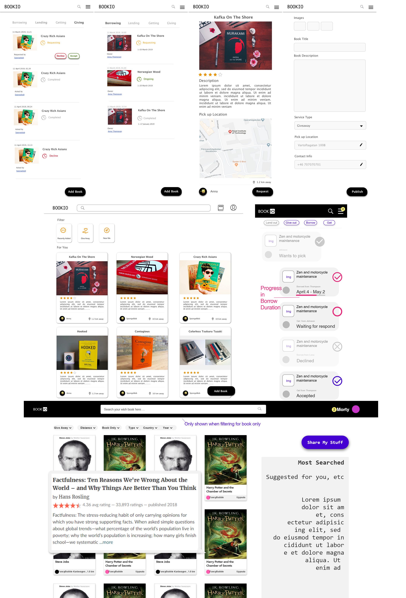

# BOOKIO | Free book-sharing made easy

BOOKIO will be a book-sharing platform where a user can lend out or give away a book for free. If renting out a book, the time span for borrowing can be specified and people looking for specific books can create advertisements. The platform requires the visitor to create a user profile, such that people have an idea whom they are interacting with. Users can create a post for renting out, or giving away, their book(s) and provide details such as time and location of pick-up. When a user uploads a book, the title will be looked up in an open book API such that a description of the book, and possibly other features such as general ratings and comments, can be provided to other users. The main page will have several search and filter options and the books will be listed in an order which is dependent on the location of the user.

## User instructions

The website's latest build is available here: [BOOKIO](https://bookio-5c798.firebaseapp.com/).

In order to be able to interact with the website, one has to create a user account. This can be done by clicking on the "Register" button on the homepage.
An account can either be made by using an email and password combination (which has to be verified) or by loging in to Facebook.\
Once the user has been authenticated, the user has access to the books upload and display, as well as a personal account page.

## What we have done

> Here is what works now:\

- Sign in/up Page
- Password forgot Page
- Books Page
- Book detail Page
- Account Page
  - Find back/change password, delete account, etc
  - Upload portrait
- Add book Page
  - Search books using Goodreads API

  - Drag and drop a picture of your book to upload
    > But the uploading function is not implemented yet, so the `Add New Book` button doesn't work now.
  -

[**Design**](#Design)

- Almost all primitive design for desktop.
- Almost all primitive design for mobile.

**Development**

> All pages developed are at primitive stage that should be refined later.

- The structure of whole project has been established
- Some custom components like Dropdown, Button are created.
- Sign in/up _(own & 3rd party)_
  > There are some minor issue with Facebook Login. But the sign up/in with email is fine.
  > 3rd Party sign in/up
- Firebase setup for storage and authentication
- Redux setup
- Google Map API setup
- Navigation Bar setup
- Account Page setup
- Add Book Page basic functionality setup
- Detail Page setup

## What we still plan to do

**Design**

- Design for searchbar since there would be suggestion while typing
- Further refinement for details
- Some design might be changed

**Development**

- Search Bar
- Notification Center
- Book History/Ongoing page
- Responsiveness of all pages
- Admin Page(**_Optional_** _If we have time_)
- Refine all these primitive pages

## Project file structure

This project was bootstrapped with [Create React App](https://github.com/facebook/create-react-app).
Any files belonging to Create React App will not be explained here.

`/scr`

- `index.js`\
  The root JS file of the project. In this file, all pages are loaded and
  react-router-dom is used to render the pages based on the URL. Also, the Redux
  store as well as the Firebase context are provided to the app in this file.

`/components`

- `/Account`\
  This folder contains four React components (Account.js, Avatar.js,
  DefaultLoginToggle and LoginManagement) that take care of displaying authUser
  information on the account page. This folder also contains two stylesheets
  (\_Account.scss and \_Avatar.scss).
- `/AddNewBookFor`\
  This folder contains two React components (AddNewBookForm.js,
  withBookTitleSuggestions.js and withtextFieldState.js) that allow the user to
  add a new book. This folder also contains a stylesheet (\_AddNewBookForm.scss).
- `/Authentication`\
  This folder contains all React components that take care of user authentication,
  which include (PasswordForget.js, SignIn.js, SignOut.js, SignUp.js and Validation).
  This folder also contains some stylesheets (\_Authentication.scss, \_PasswordForget.js,
  \_SignIn.scss, \_SignOut.scss and \_SignUp.scss).
- `/BookItem`\
  This folder contains the BookItem.js React Component. This is a presentational
  component that displays a book item. The \_BookItem.scss is the stylesheet associated
  with it.
- `/BrandLogo`\
  This folder contains the BrandLogo.js React Component. This is a presentational
  component that displays the brand logo. The \_BrandLogo.scss is the stylesheet
  associated with it.
- `/Button`\
  This folder contains the Button.js React Component. This is a presentational
  component that displays button; it has the \_BrandLogo.scss stylesheet
  associated with it.
- `/Dropdown`\
  This folder contains the Dropdown.js React Component, which is a reusable
  dropdown component. It has the \_Dropdown.scss stylesheet associated with it.
- `/Firebase`\
  This folder contains three files (firebase.js, index.js and context.js) and
  takes care of communication with the backend of our application. We created a
  withReact.js HOC that uses the React Context to enable the component that it
  encapsulates to use the Firebase functions.
- `/Footer`\
  This folder contains the Footer.js React component and a stylesheet associated
  with it (\_Footer.js).
- `/GoogleMap`\
  This folder contains the GoogleMap.js React component, which renders a Google
  Map retrieved via the Google Maps API.
- `/Loader`\
  This folder contains a standard Loader.js React component and a stylesheet
  association with it (\_Loader.scss).
- `/Navbar`\
  This folder contains the Navbar.js React component and a stylesheet
  association with it (\_Navbar.scss).
- `/PasswordChange`\
  This folder contains the PasswordChange.js React component and a stylesheet
  association with it (\_PasswordChange.scss).
- `/Session`\
  This folder contains files that take care of handling the user session.
  It contains three HOCs: withAuthentication.js, withAuthorization.js and
  withEmailverification.js, as well as a stylesheet (\_Session.scss).

`/constants`

- `roles.js`\
  This file contains role constants (currently it only contains ADMIN).
- `routes.js`\
  This file contains all routes constants.

`/helpers`

- `utils.js`\
  This file contains util functions.
- `validationHelper.js`\
  This file contains helper functions for validation.

`/hooks`

- `index.js`\
  We use [React Hooks](https://reactjs.org/hooks). In this file we define all our
  custom React hooks.

`/images`\
Folder containing test images.

`/pages`\
We decided to have a distinction between components and pages. Pages can consist
of multiple components. The filename of the page should be self-explanatory.

- `AccountPage.js`
- `AddNewBook.js`
- `PasswordForgetPage.js`
- `SignInPage.js`
- `SignUpPage.js`

`/redux`\
We use [Redux](https://redux.js.org/) for the state management of our app. The
structure of the folders is the standard best-practice structure for Redux.

- `index.js`
- `actions/`
- `constants/`
- `middleware/`
- `reducers/`
- `store/`

`/styling`

- `style.scss`\
  In this file we bundle all stylesheets, both the component specific and generic
  stylesheets.

- `includes/`\
  The includes folder contains several files and sub-folders. These can be roughly
  divded in a base stylesheet, variables stylesheets and vendor stylesheets.
  - `variables/`
  - `\_base.scss`
  - `\_variables.scss`
  - `\_vendor.scss`

## Design

> Below are some Pictures of the Design.\
> For some pages, there are 2 designs. The final decision has not be made yet.

